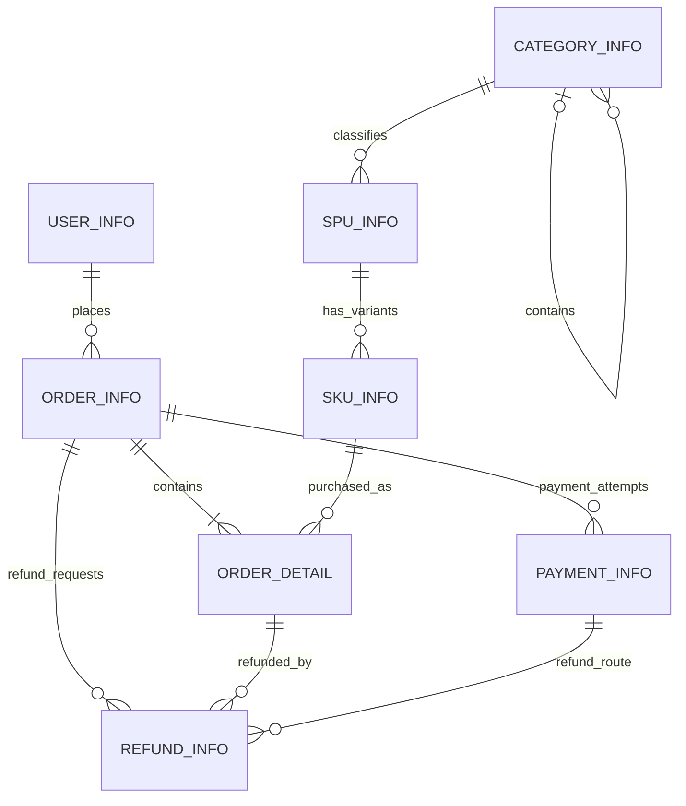

# Business Scope

第一版源数据库模拟一个小型电商业务系统，范围只包括用户、商品、下单、支付和退款。它是面向日常交易写入与业务一致性的 OLTP 模型，不是分析模型，也不包含营销、优惠券、仓库、库存、物流或任何数仓分层。

所有表使用 InnoDB、`utf8mb4` 和 `utf8mb4_0900_ai_ci`。金额统一使用 `DECIMAL(12, 2)`，当前样例业务中的金额单位均为人民币元（CNY）。业务时间使用 `DATETIME(3)` 保存毫秒精度的本地业务时间；容器与 MySQL 会话按 Asia/Shanghai（UTC+08:00）运行。

# Business Entities

## User

用户是下单主体。`user_info` 保存稳定的业务用户编号、联系方式、账户状态和记录时间。

## Category

分类用于组织商品概念。`category_info` 通过 `parent_category_id` 表达简单层级，根分类的父分类为空。

## SPU

SPU（Standard Product Unit）代表共享核心属性的商品概念，例如“星云 X1 手机”。品牌、商品名称和所属分类属于 SPU 层。

## SKU

SKU（Stock Keeping Unit）代表可以被单独定价和下单的具体销售规格，例如“星云 X1 128GB 曜石黑”。一个 SPU 可以有多个 SKU；订单明细只能购买 SKU，不能直接购买 SPU。

# Business Processes

## Place Order

下单过程由 `order_info` 和 `order_detail` 共同表达。订单头的粒度是一张用户订单，订单明细的粒度是一张订单内的一种 SKU。明细保留下单时的 SKU 名称、编码和成交单价快照，避免商品资料或目录价格更新后改变历史订单含义。

## Pay Order

支付过程由 `payment_info` 表达，粒度是一次支付尝试。失败、待处理和成功尝试都会保留，因此一次重试不会覆盖上一次尝试。

## Refund Order

退款过程由 `refund_info` 表达，粒度是针对一个订单明细、通过一笔原支付发起的一次退款请求。退款拥有自己的状态和发生时间，不用修改或覆盖原支付事实。

# Table Definitions

## `user_info`

- **Purpose**：保存可下单的注册用户。
- **Grain**：每个用户一行。
- **Primary Key**：`user_id`。
- **Important Columns**：`user_no` 是稳定业务编号；`mobile` 和非空 `email` 唯一；`user_status` 中 0 表示禁用、1 表示正常；`created_at` 是开户时间，`updated_at` 是最近修改时间。
- **Relationships**：一个用户可以拥有多张 `order_info` 订单。

## `category_info`

- **Purpose**：保存层级商品分类。
- **Grain**：每个分类节点一行。
- **Primary Key**：`category_id`。
- **Important Columns**：`category_code` 是稳定业务编码；`parent_category_id` 指向父节点；`category_level` 从根节点的 1 开始；`category_status` 中 0 表示禁用、1 表示正常。
- **Relationships**：分类可自关联父子节点；一个分类可以包含多个 `spu_info`。

## `spu_info`

- **Purpose**：保存多个销售规格共同归属的商品概念。
- **Grain**：每个 SPU 一行。
- **Primary Key**：`spu_id`。
- **Important Columns**：`spu_code` 是稳定业务编码；`spu_name` 与 `brand_name` 描述共享商品信息；`spu_status` 中 0 表示禁用、1 表示正常。
- **Relationships**：每个 SPU 属于一个分类，一个 SPU 可以包含多个 `sku_info`。

## `sku_info`

- **Purpose**：保存可以单独定价、销售和下单的具体商品规格。
- **Grain**：每个 SKU 一行。
- **Primary Key**：`sku_id`。
- **Important Columns**：`sku_code` 是稳定业务编码；`specification_json` 保存颜色、容量等规格组合；`sale_price` 是当前目录价，不代表历史成交价；`sku_status` 中 0 表示禁用、1 表示正常。
- **Relationships**：每个 SKU 属于一个 SPU，并可出现在多个 `order_detail` 中。

## `order_info`

- **Purpose**：保存订单级业务状态和金额。
- **Grain**：每张用户订单一行。
- **Primary Key**：`order_id`；`order_no` 是唯一业务订单号。
- **Important Columns**：`order_amount` 是订单行金额之和；`order_status` 为 10 待支付、20 已支付、30 已完成、40 已取消；`ordered_at` 是用户提交时间，`cancelled_at` 和 `completed_at` 是对应终态时间，`created_at` 是记录持久化时间。
- **Relationships**：每张订单属于一个用户，包含一个或多个订单明细，并可产生多次支付尝试和退款请求。

## `order_detail`

- **Purpose**：保存订单购买的 SKU、数量、成交价和商品快照。
- **Grain**：每张订单内每种 SKU 一行；同一 SKU 的数量合并在 `quantity` 中。
- **Primary Key**：`order_detail_id`；`(order_id, sku_id)` 唯一。
- **Important Columns**：`unit_price` 是下单时单价；`quantity` 是购买数量；`line_amount = unit_price * quantity`；`sku_code_snapshot` 和 `sku_name_snapshot` 保存下单时商品信息。
- **Relationships**：每个明细属于一张订单并引用一个 SKU，一个明细可以产生多次退款请求。

## `payment_info`

- **Purpose**：保存订单的每一次支付尝试及渠道结果。
- **Grain**：每次支付尝试一行。
- **Primary Key**：`payment_id`；`payment_no` 是唯一业务支付号；`(order_id, payment_attempt_no)` 唯一。
- **Important Columns**：`payment_channel` 为 WECHAT、ALIPAY 或 BANK_CARD；`payment_status` 为 10 待处理、20 成功、30 失败、40 已关闭；`payment_amount` 是本次尝试金额；`requested_at` 是发起时间，`paid_at` 是成功确认时间，`closed_at` 是失败或关闭终态时间。
- **Relationships**：每次支付尝试属于一张订单；成功支付可以作为多个退款请求的原支付路径。

## `refund_info`

- **Purpose**：保存独立退款请求及其处理结果。
- **Grain**：针对一个订单明细、通过一笔原支付发起的一次退款请求一行。
- **Primary Key**：`refund_id`；`refund_no` 是唯一业务退款号。
- **Important Columns**：`refund_status` 为 10 待处理、20 成功、30 失败、40 已取消；`refund_quantity` 和 `refund_amount` 是本次请求范围；`requested_at` 是申请时间，`refunded_at` 是退款成功时间，`closed_at` 是失败或取消终态时间。
- **Relationships**：每次退款引用订单、订单明细和原支付。应用事务必须保证三者属于同一业务链路，并且原支付已经成功。

# Relationship Overview



# Modeling Decisions

## SPU 与 SKU 的区别

SPU 解决“这些销售规格属于同一个商品概念”的问题，SKU 解决“用户实际购买的是哪个可售规格”的问题。把分类、品牌和共享名称放在 SPU，把颜色、容量、当前售价等销售规格放在 SKU，可以减少共享信息重复，同时让订单明确引用可成交对象。

另一种方案是只建一张商品表，但它会重复品牌和商品概念信息，也难以清楚表达规格变体。因此本项目保留 SPU/SKU 两层。`specification_json` 仅承载第一版少量且多变的规格键值；若未来业务需要按规格强校验或复杂检索，可以再评估规范化的规格定义表。

## 为什么拆分 `order_info` 和 `order_detail`

一张订单可以购买多种 SKU。订单状态、用户和订单总额只属于订单头，而 SKU、数量、成交单价属于订单行，两者粒度不同。如果放在一张表中，订单级字段会随每个 SKU 重复；如果把多个 SKU 塞入 JSON，又会削弱约束和交易查询能力。因此采用标准的一对多订单头/订单行结构。

订单总额与明细合计的跨行一致性无法由普通 `CHECK` 约束表达，写入订单时必须由应用在同一数据库事务中校验并提交。

## 为什么支付不直接放到 `order_info`

支付不是订单的一个静态属性，而是有渠道、外部交易号、状态和时间线的独立过程。用户可能失败后重试；若把支付字段放在订单头，新的尝试会覆盖旧记录，无法解释历史状态。独立的 `payment_info` 还让订单状态和支付渠道状态保持各自职责。

第一版允许一张订单有多次**支付尝试**，但不支持拆单支付或多笔成功支付共同完成一张订单：每次尝试都应支付完整 `order_amount`，同一订单最多一笔成功支付。`(order_id, payment_attempt_no)` 在数据库中防止尝试序号重复；“最多一笔成功”需要应用在事务中通过幂等键、锁定订单和状态检查保证。也可以使用生成列配合唯一索引强制唯一成功记录，但首版不引入这种 MySQL 特定技巧，以保持业务表和规则直观。

## 为什么退款是独立业务过程

退款发生在支付之后，但它不是对支付记录的简单反向修改。一次支付可以对应多次部分退款，每次退款可能待处理、失败、取消或成功，并拥有自己的原因、数量、金额、外部退款号和时间线。保留独立记录才能重试、审计并计算累计退款，而不会破坏原支付事实。

第一版的一次退款只针对一个订单明细。一个订单明细允许多次退款，以支持分批或部分退款。部分退款需要区分两个口径：

- **Succeeded Refund**：`refund_status = 20`，表示退款已经成功。实际“已退款金额”指标只统计这个状态的 `refund_amount`。
- **Reserved Refund**：`refund_status IN (10, 20)`，包括待处理和已成功退款。待处理退款也必须预占可退款数量和金额，避免多个并发的 pending refund 同时超额申请。

应用必须在同一事务中校验并保证以下累计约束：

```text
SUM(refund_quantity) WHERE refund_status IN (10, 20)
<= order_detail.quantity

SUM(refund_amount) WHERE refund_status IN (10, 20)
<= order_detail.line_amount
```

状态为失败（30）或已取消（40）的退款不占用可退款额度。数据库外键只能保证所引用的记录存在，应用还必须校验 `order_id`、`order_detail_id` 与 `payment_id` 属于同一订单，且原支付状态为成功。

## Foreign Key 策略

第一版实际创建 Foreign Key。当前是单节点、小数据量、以学习正常业务关系为目标的 OLTP 数据库，数据库约束能尽早暴露无效用户、商品、订单、支付或退款引用。所有业务外键使用 `ON DELETE RESTRICT ON UPDATE RESTRICT`，不级联删除交易历史；需要清理本地环境时应删除整个开发卷，而不是删除父记录。

高吞吐或分库分表系统有时由应用维护引用完整性，以降低跨表约束和迁移成本。但当前没有这种规模需求，去掉外键只会降低样例数据的可验证性。少数跨记录业务不变量，例如订单金额等于明细合计、最多一笔成功支付、退款链路同属一个订单和累计退款上限，仍需应用事务处理，因为普通外键和行级 `CHECK` 无法完整表达。

## 索引策略

唯一索引用于业务编号、联系方式和外部交易号；普通索引用于外键访问以及常见的“按用户/状态和时间查订单”“按订单和时间查退款”。没有为低选择性的状态列单独建索引，也没有为每一列机械加索引。后续应根据真实查询和执行计划再调整。

# Warehouse Mapping Preview

这些规范化 OLTP 表未来会作为数仓的数据源。后续阶段可以基于业务实体、业务过程、主键和明确的事件时间逐步学习如何抽取与建模；本阶段不定义任何正式数仓分层、维度表或事实表。
